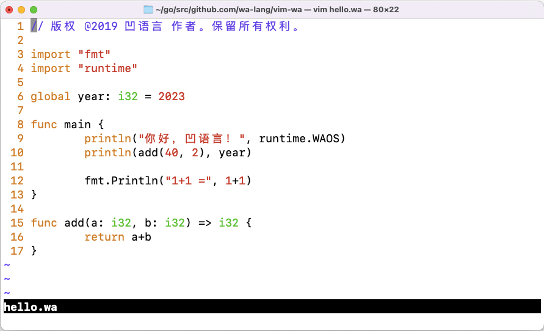

# VIM 凹语言插件

本仓库是 VIM 凹语言插件，用于支持凹语言语法高亮等特性。凹语言™（凹读音“Wa”）是 针对 WASM 平台设计的的通用编程语言，支持 Linux、macOS 和 Windows 等主流操作系统和 Chrome 等浏览器环境，同时也支持作为独立Shell脚本和被嵌入脚本模式执行。主页 (Homepage): [https://wa-lang.org](https://wa-lang.org)


首先克隆本仓库到本地(假设目录路径为 `$VIM_WA_ROOT`)，然后在 `$HOME/.vimrc` 文件添加以下配置信息：

```vim
set rtp+=$VIM_WA_ROOT/misc/vim
filetype plugin indent on
syntax on
```

打开 [hello.wa](hello.wa) 文件，效果如下图：



目前只有几本功能，后面会逐步完善。
